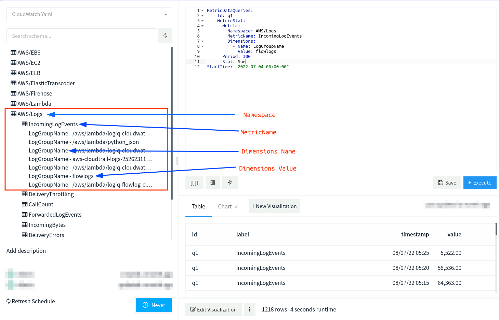

# Amazon CloudWatch ( YAML )

LOGIQ connects to Amazon CloudWatch using the boto3 client with the help of the AWS CloudWatch data source making it easy for you to query CloudWatch metrics using its natural syntax, analyze, monitor, and create Visualization of data.


Before you query your CloudWatch data, you should set up authentication credentials. Credentials for your AWS account can be found in the IAM Console. You can create or use an existing user. Go to manage access keys and generate a new set of keys.


### Adding Amazon CloudWatch ( YAML ) data source

The first step is to create an Amazon CloudWatch data source and provide all details such as the Name, AWS Region, AWS Access Key, AWS Secret Key

* **Name:**  Name of the Data Source
* **AWS Region**:  Region of your AWS account
* **AWS Access Key:** access\_key\_id of your IAM Role
* **AWS Secret Key:** secret\_access\_key of your IAM Role


### Querying CloudWatch

These instructions assume you are familiar with the CloudWatch ad-hoc query language. To make exploring your data easier the schema browser will show which **Namespaces** and **Metrics ( optionally dimensions )** you can query.



To query you should be familiar with YAML syntax.  It should be an array of **`MetricDataQuery`** objects under a key called **`MetricsDataQueries`**.

Here's an example that sends **`MetricDataQuery`**

```
MetricDataQueries: 
  - Id: q1
    MetricStat:
      Metric:
        Namespace: AWS/Logs
        MetricName: IncomingLogEvents
        Dimensions:
          - Name: LogGroupName
            Value: flowlogs
      Period: 300
      Stat: Sum
StartTime: "2022-07-04 00:00:00"
```

Your query can include the following keys:

| Key           |                       |
| ------------- | --------------------- |
| LogGroupName  | string                |
| LogGroupNames | array of strings      |
| StartTime     | integer or timestring |
| EndTime       | integer or timestring |
| QueryString   | string                |
| Limit         | integer               |

### Querying AWS Lambda Metrics

Let's look at a slightly more complex example and query AWS Lambda metrics for AWS Lambda Errors. In this example, we are using the **MetricName**: _"Errors"_ for the _"AWS/Lambda"_ **Namespace.**

When selecting the AWS/Lambda Namespace, you can see the available MetricNames

* **AWS/Lambda**
  * Errors
  * ConcurrentExecutions
  * Invocations
  * Throttles
  * Duration
  * IteratorAge
  * UnreservedConcurrentExecutions

Below is an example query that tracks AWS Lambda errors as an aggregate metric. The _StartTime_ is templatized and allows dynamic selection.

```
MetricDataQueries: 
  - Id: q1
    MetricStat:
      Metric:
        Namespace: AWS/Lambda
        MetricName: Errors
      Period: 300
      Stat: Sum
StartTime: "{{StartTime}}"
```

You can further click on the _Errors_ **MetricName** and it will expand to show you **Dimensions** available for further querying. For AWS/Lambda, the **Dimension** _FunctionName_ provides further drill down to show Cloudwatch metrics by Lambda Function Name.

```
MetricDataQueries: 
  - Id: q1
    MetricStat:
      Metric:
        Namespace: AWS/Lambda
        MetricName: Errors
        Dimensions:
          - Name: FunctionName
            Value: <My lambda function name>
      Period: 300
      Stat: Sum
StartTime: "{{StartTime}}"
```

The query can be further enhanced by making the lambda function name, a templatized parameter. This allows you to pull metrics using a dropdown selection e.g. a list of lambda functions. The FunctionName template below can also be retrieved from another database as a separate query.

```
MetricDataQueries: 
  - Id: q1
    MetricStat:
      Metric:
        Namespace: AWS/Lambda
        MetricName: Errors
        Dimensions:
          - Name: FunctionName
            Value: {{FunctionName}}
      Period: 300
      Stat: Sum
StartTime: "{{StartTime}}"
```
