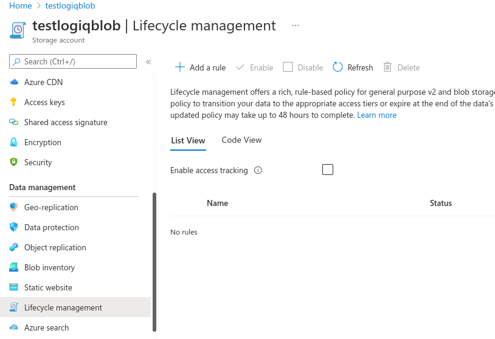

# Azure Blob Storage Lifecycle Management

Azure Blob Storage lifecycle management lets you move your data to the best access tier and expire data at the end of its lifecycle with a set of rule-based policies. When using Azure Blob Storage with the LOGIQ platform, you can leverage Azure Blob Storage lifecycle management policies to build and employ rules that manage the lifecycle and cost of the data ingested by your LOGIQ instance and stored on Azure Blobs.&#x20;

You can use Azure Blob Storage lifecycle management policies to:

* Immediately move blobs from cool to hot storage tiers on access, to optimize for performance.
* Move blobs, blob versions, and blob snapshots to a cooler storage tier if they've not been accessed or modified for a while, to optimize for cost. In this scenario, the lifecycle management policy can move objects from hot to cool, from hot to archive, or from cool to archive.
* Delete blobs, blob versions, and blob snapshots at the end of their lifecycles.
* Define rules to be run daily at the storage account level.
* Apply rules to containers or to a subset of blobs, using name prefixes or blob index tags as filters.

### Configuring lifecycle management rules

A lifecycle management policy contains one or more rules that define a set of actions to take on a blob based on a pre-configured condition being met. To add lifecycle management rules in your Storage Account, do the following.

**Step 1:**  On your Storage account in the Azure portal, navigate to the **Data Management section** and click on **Lifecycle management** > **Add a rule**.

**Step 2:** Provide a **Rule name** and then select the following options.&#x20;

* Under **Rule scope**, select **Limit blobs with filters**
* Under **Blob subtype**, select **Base blobs**

**Step 3:** On the **Base blobs** tab, you can setup data retention and choose what you'd like to do with the data post the retention period. In this example, we've chosen to retain data for 30 days and delete the data post the 30-day retention period.&#x20;

To set up a similar rule, do the following.&#x20;

* Under the **If** condition, set the retention period to 30 days.&#x20;
* Under the **Then** condition, select **Delete the blob** from the dropdown menu.&#x20;
* Optionally, set up additional qualifiers and conditions if you'd like more granular control over data lifecycle management by clicking **Add conditions** and configuring the conditions accordingly.&#x20;

**Step 4:** Since we selected **Limit blobs with filters** on the **Details** page, select **Filter set** to add an optional filter. On this tab, you can add prefixes to help identify which blobs to delete when the data lifecycle condition is met. If you do not set a prefix, all the objects in the container will be deleted. The prefix follows the format: `<container_name>/<blob_name>`

In this example, we set a prefix that deletes objects that store logs from the `qradar` namespace in the `default_log_store` blob inside the `testlogiqblog` container.&#x20;

This completes the configuration of a single data lifecycle management rule on your Azure Storage account. You can add and configure as many rules as you deem appropriate based on your data lifecycle needs.&#x20;
