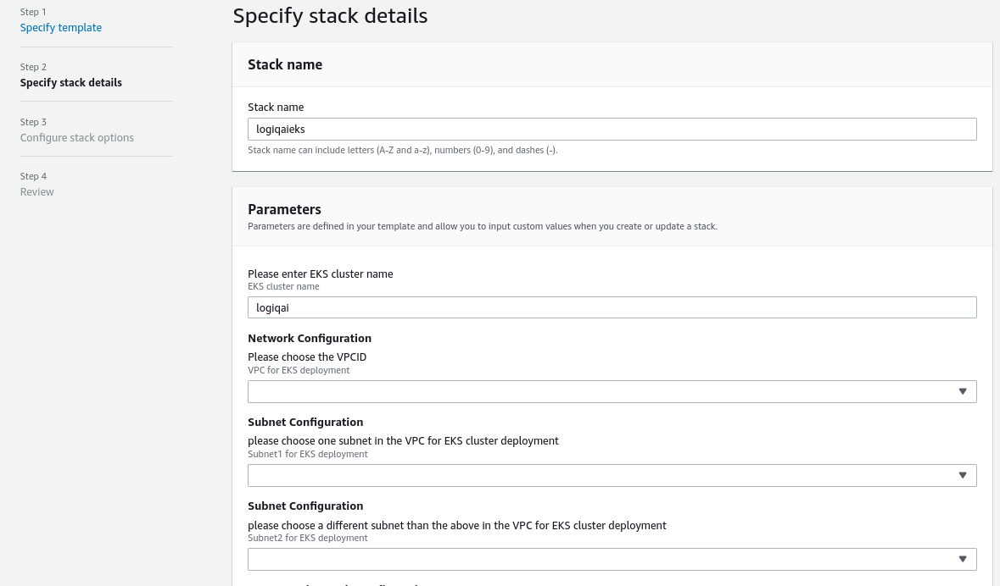
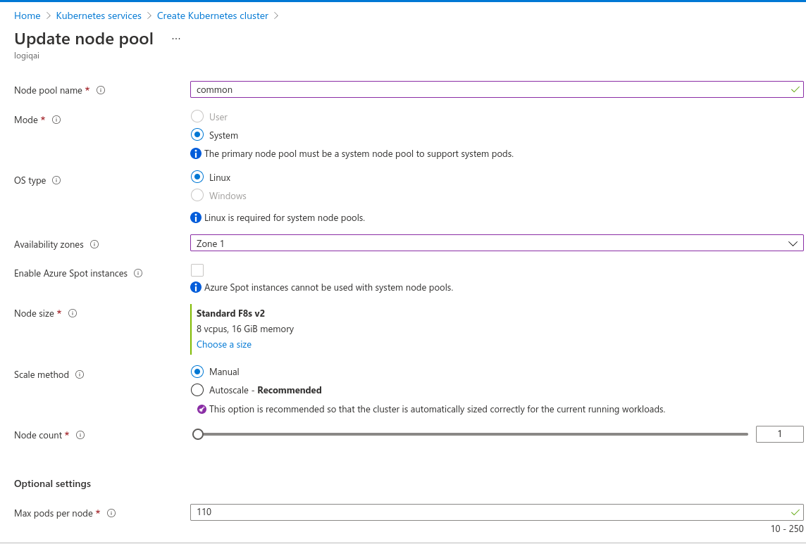
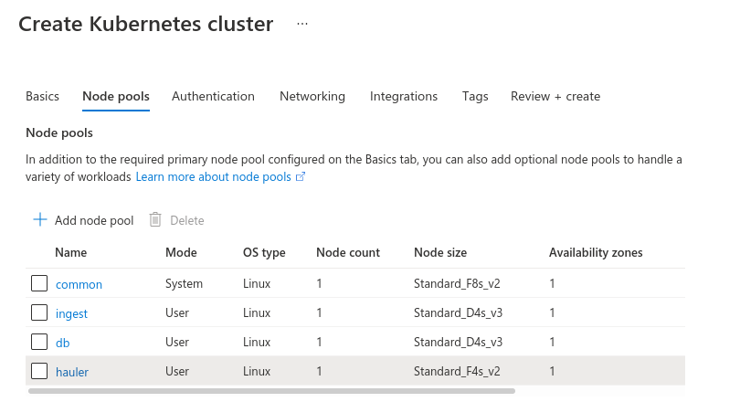

# Deploying LOGIQ PaaS in Azure Kubernetes Service

The following guide takes you through deploying LOGIQ PaaS in an Azure Kubernetes Service cluster. The deployment involves the following steps:

* [<mark style="color:blue;">Creating an Azure Kubernetes Service cluster</mark>](./#creating-an-azure-kubernetes-cluster)<mark style="color:blue;"></mark>
* [<mark style="color:blue;">Configuring the node pool</mark>](./#configuring-the-node-pool)<mark style="color:blue;"></mark>
* <mark style="color:blue;"></mark>[<mark style="color:blue;">Connecting to the cluster</mark>](./#connecting-with-your-aks-cluster)<mark style="color:blue;"></mark>
* <mark style="color:blue;"></mark>[<mark style="color:blue;">Creating the MinIO blob storage gateway</mark>](./#creating-the-minio-blob-storage-gateway-for-s3-compatibility)<mark style="color:blue;"></mark>
* Deploying LOGIQ PaaS


If you have an AKS cluster that is appropriately sized for deploying LOGIQ and handling your data ingestion rate, you can skip the AKS cluster creation step. However, you must label the nodes as specified in the [<mark style="color:blue;">Node pool configuration</mark>](./#node-pool-configuration) table failing which the pods in the cluster will not land in any of the nodes.&#x20;


## Creating an Azure Kubernetes Cluster

From the Azure portal **Home** page, search for Kubernetes, and then click **Kubernetes services** from the search results.



Click on **Create** > **Create Kubernetes cluster**

Under **Project details**, select:

* An Azure **Subscription**
* Select or create an Azure **Resource group**
* Select 2 availability zones

Under **Cluster details**, configure the following:

* **Kubernetes cluster name**
* Select a **Region** for the deployment
* Select two **Availability zones**
* Set the Kubernetes version to **`1.19.11`**

## Configuring the node pool

Create four node pools as described in the following table. The below configuration is for ingesting 24 GB/day. Ensure that the node pools are all only **one availability zone.**

#### Node pool configuration

| **Size**                   | **Node pool**             | **Node labels**      | **Node count** |
| -------------------------- | ------------------------- | -------------------- | -------------- |
| 4 Core 8 GB RAM (D4s\_v3)  | Ingest (CPU intensive)    | logiq.ai/node=ingest | 1              |
| 8 Core 16 GB RAM (F8s\_v2) | Common (Memory intensive) | logiq.ai/node=common | 1              |
| 4 Core 8 GB RAM (F4s\_v2)  | Hauler                    | logiq.ai/node=hauler | 1              |
| 4 Core 8 GB RAM (D4s\_v3)  | db                        | logiq.ai/node=db     | 1              |

The following screenshots depict the labeling of the node pools.

 

Your node pool should look like the below and they should all be placed in one availability zone and ensure they are labelled as listed under [Node-pool configuration](./#node-pool-configuration).



Review your configuration and click **Create**.

## Connecting with your AKS cluster

To connect with the Kubernetes cluster you just created, first ensure you have [<mark style="color:blue;">Azure CLI</mark> ](https://docs.microsoft.com/en-us/cli/azure/)installed. Using your terminal, execute the following command to configure Azure CLI. You can find your `tenant-id` under Azure Active Directory.

```
az login --tenant “tenant-id”
```

Next, navigate to the Kubernetes service screen and select your cluster. Click on the **Connect** icon and follow the instructions displayed on the right panel.

## Creating the MinIO blob storage gateway for S3 compatibility&#x20;

Follow the instructions on <mark style="color:blue;"></mark> [<mark style="color:blue;">MinIO’s site</mark>](https://az.minio.io/index.html#deploy-minio-6) to create a MinIO Blob Storage Gateway. Once you login, create a bucket inside MinIO, and copy the access keys.&#x20;

While deploying LOGIQ PaaS in the next step, you'll need to configure the following parameters in the values.yaml file to use the MinIO blob storage gateway you just created.&#x20;

```
s3_bucket: <Bucket created in MinIO>
awsServiceEndpoint: https://<your-blobstorage-accountname>.az.minio.io
AWS_ACCESS_KEY_ID: <Storage account name>
AWS_SECRET_ACCESS_KEY: <Access key from MinIO>
```

## Deploying LOGIQ PaaS

You can now deploy LOGIQ PaaS on your AKS cluster by following the instructions listed in the  LOGIQ <mark style="color:blue;"></mark> [<mark style="color:blue;">Kubernetes quick start guide</mark>](../k8s-quickstart-guide.md). <mark style="color:blue;"></mark>&#x20;
