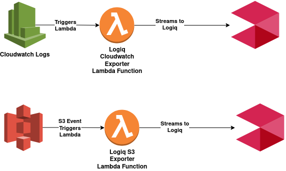

# AWS S3

## LOGIQ S3 exporter Lambda function




### Creating Lambda function

LOGIQ provides a CloudFormation template to create the logiq S3 exporter lambda function.&#x20;

```
https://logiqcf.s3.amazonaws.com/s3-exporter/cf.yaml
```


The same code is available in our [client-integrations](https://bitbucket.org/logiqcloud/client-integrations/src/master/cloudwatch-exporter/) git repository.


This CloudFormation stack creates a lambda function and its necessary permissions. The following attributes need to be configured.

| Parameter   | Description                                                    |
| ----------- | -------------------------------------------------------------- |
| APPNAME     | Application name, A readable name for Logiq to partition logs. |
| CLUSTERID   | Cluster ID, A readable name for Logiq to partition logs.       |
| NAMESPACE   | Namespace, A readable name for Logiq to partition logs.        |
| LOGIQHOST   | IP address or hostname of Logiq server.                        |
| INGESTTOKEN | JWT token to securely ingest logs                              |

## Configuring S3 trigger

Once the CloudFormation stack is created, navigate to the AWS Lambda function(logiq-s3-logs-exporter) and add a S3 trigger.&#x20;


On the Add trigger page, select S3 and select Bucket and prefix.&#x20;


Once this configuration is complete, any new log files in the s3 bucket will be streamed to the Logiq cluster.
