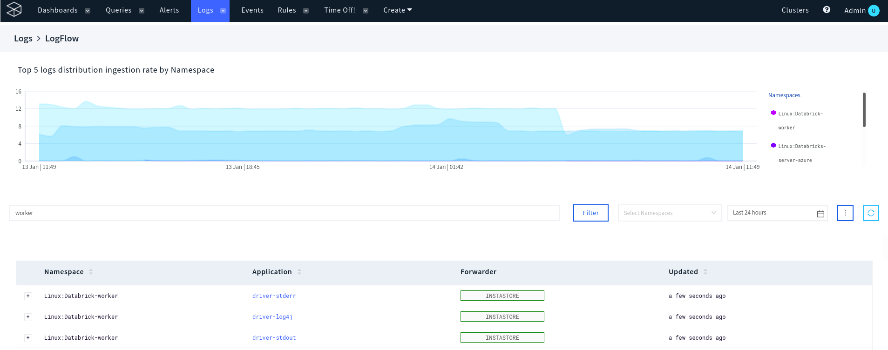

# Azure Databricks

This guide take you through how you can forward your logs from an Azure Databircks cluster to LOGIQ. Before you proceed with this setup, ensure that you meet the following prerequisites.&#x20;

* Private VNI
* An Azure Databricks cluster in private VNI
* LOGIQ endpoint


**Note:** The Databricks cluster must be launched in your own private EMI failing which the default deployment of the Databricks cluster will be fully managed by Azure, the resource group will be locked, and SSH connections to the node will be disabled.&#x20;

For more information on deploying Azure Databricks in your own private EMI, refer to [Deploy Azure Databricks in your Azure virtual network (VNet injection)](https://docs.microsoft.com/en-us/azure/databricks/administration-guide/cloud-configurations/azure/vnet-inject).


### Configuring your Databricks cluster to forward logs

To configure your Azure Databricks cluster to forward logs to your LOGIQ endpoint, do the following.&#x20;

* Navigate to the **Compute** section on your Azure portal.&#x20;
* Click **Create Cluster**.
* Choose your cluster size.
* Click **Advanced options >** **SSH**. **** Paste your public key under **SSH public key**. You can generate a public key by running the command `ssh-keygen -t rsa -b 4096 -C "email-id”`. You will use the private key to log into the machine later on.

>)

* Next, on the Azure portal, under **Network security group**, add port `2200` in the **Inbound ports** section for the machines that the Databricks cluster spun up.

### Installing and configuring Fluent Bit

To install and configure Fluent Bit on your Databricks cluster, do the following.&#x20;

* Log into the machine using the following command.

```
ssh ubuntu@machine-ip -p 2200 -i <private_key_file_path>
```

* Install Fluent Bit as per the version of Ubuntu OS running on the machine. For detailed installation instructions, refer to the [Fluent Bit documentation](https://docs.fluentbit.io/manual/installation/getting-started-with-fluent-bit).&#x20;
* Use the following Fluent Bit configuration file.

```
[SERVICE]
    Flush        1
    Parsers_File /etc/td-agent-bit/parsers.conf
    Log_Level   debug 

[INPUT]
    Name tail
    Path /dbfs/cluster-logs/*/driver/stdout*
    Tag  driver-stdout
    Buffer_Max_Size 1MB
    Ignore_Older     5m


[INPUT]
    Name tail
    Path /dbfs/cluster-logs/*/driver/*.log
    Tag  driver-log4j
    Buffer_Max_Size 1MB
    Ignore_Older     5m


[INPUT]
    Name tail
    Path /dbfs/cluster-logs/*/driver/stderr*
    Tag  driver-stderr
    Buffer_Max_Size 1MB
    Ignore_Older     5m

    
[INPUT]
    Name tail
    Path /dbfs/cluster-logs/*/eventlog/*/*/eventlog
    Tag  eventlog
    Buffer_Max_Size 1MB
    Ignore_Older     5m


[INPUT]
    Name tail
    Path /dbfs/cluster-logs/*/executor/*/*/stdout*
    Tag  executor-stdout
    Buffer_Max_Size 1MB
    Ignore_Older     5m


[INPUT]
    Name tail
    Path /dbfs/cluster-logs/*/executor/*/*/stderr*
    Tag  executor-stderr
    Buffer_Max_Size 1MB
    Ignore_Older     5m
    
[FILTER]
    Name record_modifier
    Match driver-stdout 
    Record AppName driver-stdout

[FILTER]
    Name record_modifier
    Match eventlog 
    Record AppName eventlog
    
[FILTER]
    Name record_modifier
    Match driver-stderr
    Record AppName driver-stderr

[FILTER]
    Name  record_modifier
    Match driver-log4j
    Record AppName driver-log4j


[FILTER]
    Name record_modifier
    Match executor-stdout
    Record AppName executor-stdout

[FILTER]
    Name  record_modifier
    Match executor-stderr
    Record AppName executor-stderr

[FILTER]
    Name          record_modifier
    Match         *
    Record cluster_id Linux
    Record linuxhost ${HOSTNAME}
    Record namespace Databrick-worker

[FILTER]
    Name modify
    Match *
    Rename ident AppName
    Rename procid proc_id 
    Rename pid proc_id


[FILTER]
    Name parser
    Match *
    Key_Name data
    Parser syslog-rfc3164
    Reserve_Data On
    Preserve_Key On

[OUTPUT]
    name stdout
    match *

[OUTPUT]
    name     http
    match    *
    host      <Logiq endpoint>
    port     443
    URI      /v1/json_batch
    Format   json
    tls      on
    tls.verify  off
    net.keepalive  off
    compress      gzip
    Header Authorization Bearer <TOKEN>
```

* In the Fluent Bit configuration file above, substitute the following details based on your implementation.&#x20;
  * `logiq-endpoint`
  * `TOKEN`
  * `Databricks-worker`
* Next, replace the existing configuration at `/etc/td-agent-bit/td-agent-bit.conf` with the modified file.
* Finally, restart Fluent Bit by running the following command.&#x20;

```
systemctl restart td-agent-bit
```

Now, when you log into your LOGIQ UI, you should see the logs from your Azure Databricks cluster being ingested.


