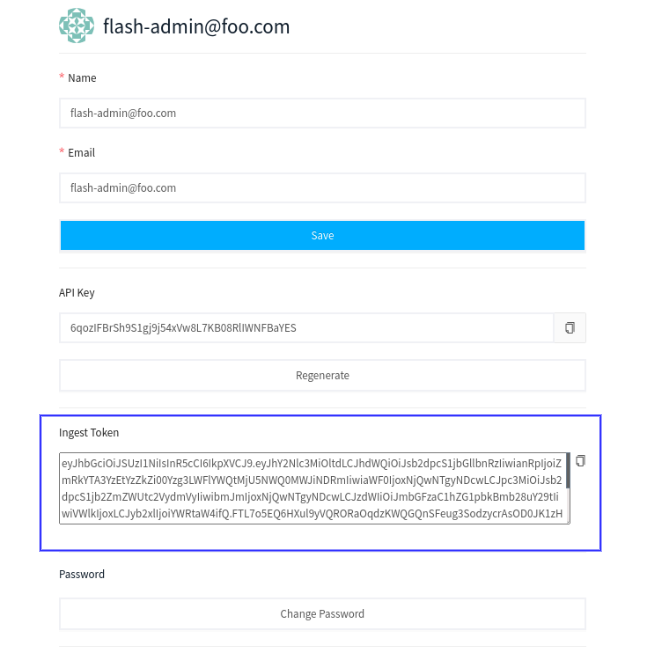

# Generating a secure ingest token

LOGIQ uses an ingest token to secure the ingestion of log data from your data sources into your LOGIQ deployment. You can generate a secure ingest token using the LOGIQ UI and the command-line tool, [logiqctl](https://logiqctl.logiq.ai/).&#x20;

### Obtaining an ingest token using UI

You can obtain a secure ingest token from the Edit Profile page on the LOGIQ UI.

 (1) (1).png>)

To begin, click on the user name on the navbar, and then click "**Edit Profile**". Your secure ingest token will be displayed under the **Ingest Token** field. Click the **Copy** icon next to the token to copy it to your clipboard.&#x20;



### Generating using logiqctl

To generate a secure ingest token, do the following.&#x20;

1. [Install](https://logiqctl.logiq.ai/#quickstart) and [configure](https://logiqctl.logiq.ai/#configuring-logiqctl) `logiqctl`, if you haven't already.&#x20;
2.  Run the following command to generate a secure ingest token:

    ```bash
    logiqctl get httpingestkey
    ```
3. Copy the ingest key generated by running the command above and save it in a secure location.&#x20;

You can now use this ingest token while configuring LOGIQ to ingest data from your data sources, especially while using log forwarders like Fluent Bit or Logstash.&#x20;

