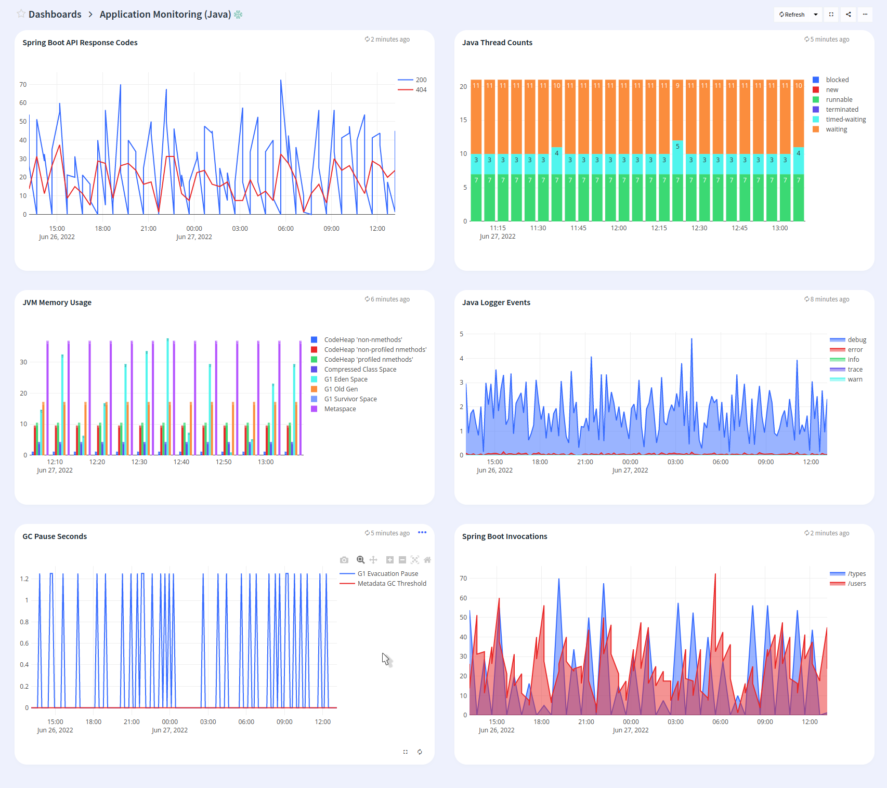

# Spring Boot

### Spring Boot Actuator and Micrometer

[Spring Boot Actuator](https://docs.spring.io/spring-boot/docs/current/reference/htmlsingle/#production-ready) is a sub-project of Spring Boot that adds several production-grade services to your application with little effort on your part. It exposes various operational information about the running application - health, metrics, audit entries, scheduled tasks, env settings, etc. You can query the data via several HTTP endpoints. In this guide, we discuss how to enable API and other metrics using Actuator and micrometer.&#x20;

[Micrometer](https://micrometer.io/) provides a simple facade over the instrumentation clients for the most popular monitoring systems, allowing you to instrument your JVM-based application code without vendor lock-in. Think SLF4J, but for metrics.

### Enabling Actuator and Micrometer dependencies

In Spring Boot's pom.xml file, add the Spring Boot Actuator and Micrometer dependencies to enable Prometheus monitoring, as shown below.&#x20;

```
// Enable Actuator dependency
<dependency>
   <groupId>org.springframework.boot</groupId>
   <artifactId>spring-boot-starter-actuator</artifactId>
</dependency>

// Enable Micrometer Prometheus dependency
<dependency>
  <groupId>io.micrometer</groupId>
  <artifactId>micrometer-registry-prometheus</artifactId>
  <scope>runtime</scope>
</dependency>
```

Next, in Spring Boot's `application.properties` file, add the following line.&#x20;

```
// Enable Actuator Endpoints in application.properties
management.endpoints.web.exposure.include=health,info,prometheus
```

Restart the server and navigate to `http://localhost:<port>/actuator/` to verifiy if the Actuator endpoints are enabled.&#x20;

 (1) (1) (1) (1) (1) (1).png>)

Navigate to `http://localhost:<port>/actuator/prometheus` and verify if your Prometheus metrics are being displayed.

 (1) (1) (1) (1).png>)

### Enable API Timings

Micrometer comes with a [timed annotation](https://micrometer.io/docs/concepts#\_the\_timed\_annotation). Annotate Spring Controller methods with the`@Timed`annotation, as shown below.&#x20;

 (1) (1) (1) (1).png>)

Restart the server, invoke your APIs a few times and navigate to `http://localhost:<port>/actuator/prometheus`. You will now see the API stats being displayed along with other metrics.&#x20;

 (1) (1) (1) (1) (1) (1).png>)

Once these metrics are available, you can use LOGIQ to visualize them and set up alerts for important events. The following image depicts an example of Spring Boot monitoring dashboard built by visualizing metrics ingested into LOGIQ via Prometheus.&#x20;



