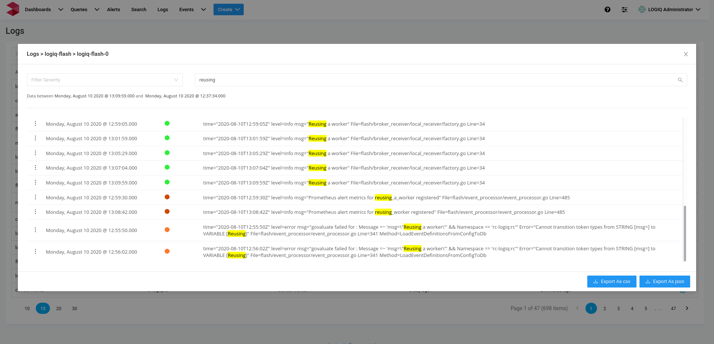
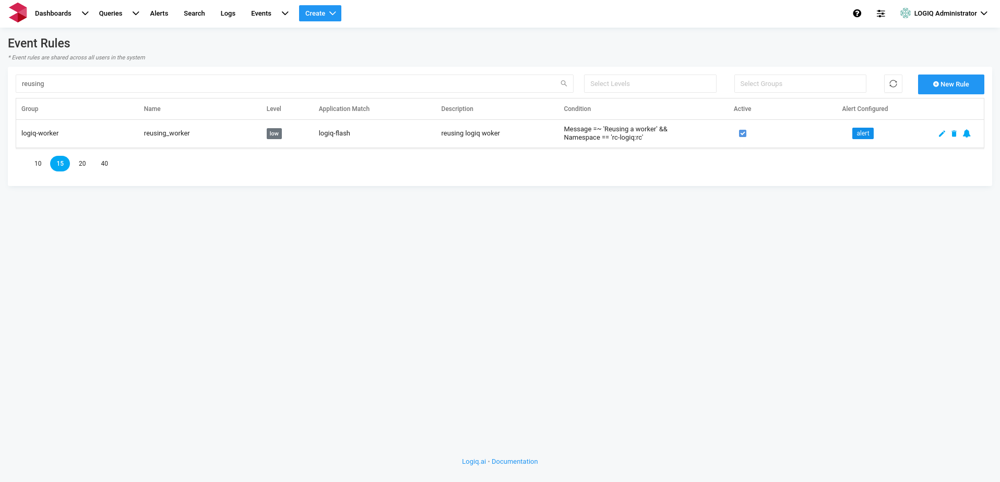
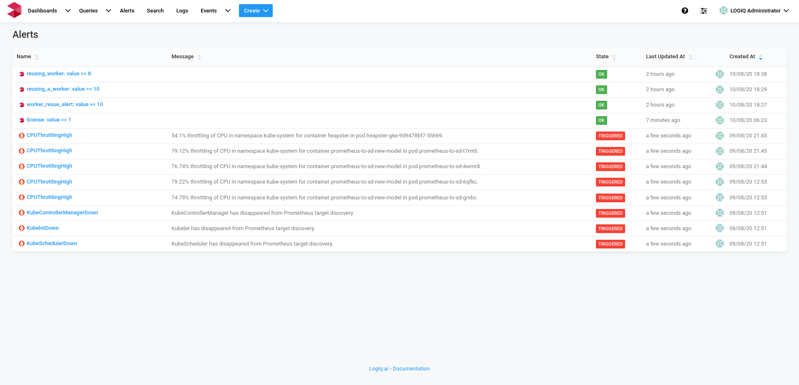

# Alertable Events

Alerts can be configured from log data from either the Search or the Logs pages. For example, while scrolling through context logs or search logs, if we want to get alerted on a line of log that is of interest, user can directly create an **alertable** **event** from the log line.

E.g., we want to receive an alert when a particular event \(i.e. occurance of the text`Reusing worker` in above example\) occurs multiple times say in any 5 minute duration. On clicking the  on the log line, user can open the Alertable event rule editor.

### Creating an alertable event

#### Fields

* **Name**: A name for the alert, should be alphanumeric.
* **Level**: one of the:  `low`, `medium`, `high` or `critical`
* **Group**: Select a predefined group or add a new.
* **Description**: A human-readable description of the alert.
* **Namespace**: Auto populated and non-editable field.
* **Application Match**: Auto populated field, editable, and match could be a regex as well.
* **Message**: The expression on which events will get generated. Supports [RE2](https://github.com/google/re2/wiki/Syntax) regex.
* **Application**: Auto populated from the logline.
* **Severity String**: Auto populated from the logline.
* **Facility String**: Auto populated from the logline.
* **Data Sources**: Prometheus instance that is used for monitoring the event counters. This is non-editable
* **Destination**: This is a user-specified selection where the alerts will be delivered. Only [user-defined alert destinations](../logiq-ui-configuration/alert-destinations.md) will be available for selection.
* **Operation**: One of the comparators: `>` `>=` `<` `<=` `==` `!=` `=~` `!~`
* **Occurrences**: number of times the event must occur, must be a valid number.
* **Period**: time over which the event occurred, e.g, `5m`, `10m`, `1h`, `1d`, `1w`. Period should be greater than `5m` \(`300s`\) and should be greater than or equal to Refresh schedule.
* **Rearm**: how frequently you will receive notifications when your query meets the Alert criteria and does not change, must be a valid number \(seconds\) minimum `300` seconds.
* **Refresh Schedule**: how frequently the query needed to be refreshed in seconds, must be a valid number.
* **Until**: select when to stop the alerts. If not selected, the alert will never expire.

All the events created can be accessed at the events page and if the alert is configured on that event, it will be present as a column in the alert row.

Clicking on the configured alert will open up the respective alert page where it can be modified further for e.g. change the alert rearm duration, add additional alert destinations etc.

### Viewing Alerts

All the configured alerts are viewable when navigating to the alerts tab. An Individual alerts' configuration can be edited on this page


LOGIQ includes alerts from it's Prometheus alert manager instance that is included with the LOGIQ install. NOTE that the editing of the Prometheus alert rules cannot be done via the UI and must use alert manager CRD's to change those alert rules.


