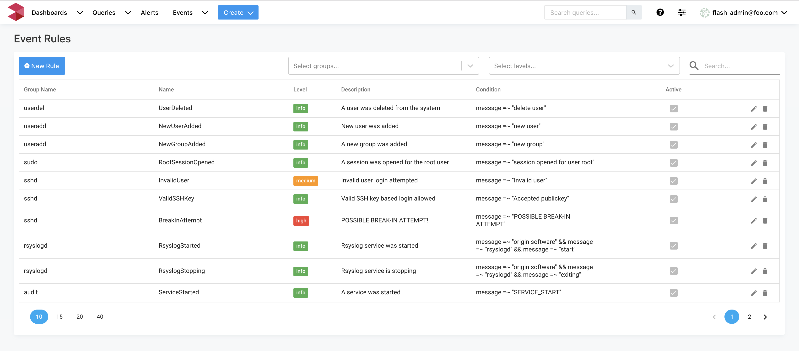
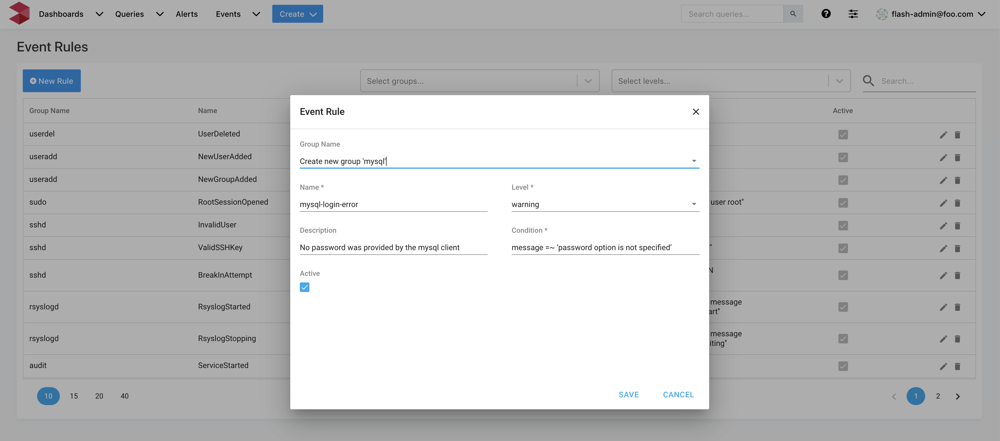

# Event Rules

## Event Rules UI

To access event Rules UI, click on "**Events**" menu and pick "**Rules**" option as shown in the screenshot below.


## Viewing Event Rules

The Event Rules page lists all the available rules in the LOGIQ server. Each rule consists of following:

* **Group Name**: Denotes logical grouping of event rules. Typically, but not necessarily, it is the application or service name.
* **Name**: Unique name to identify the event rule.
* **Level**: It can be one of _**"Info", "Warning" or "High"**_.
* **Description**: A human readable description of the event.
* **Condition**: An expression applied to ingested data. Events are triggered when the boolean condition  evaluates to "True". Please see refer to [Writing condition expressions](event-rules.md#condition-expression-syntax).
* **Active**: This fields indicates whether the event rule condition is enabled and has to be applied to the incoming data. Rules that are inactive are ignored.

Out of the box LOGIQ server comes with commonly needed system defined Event Rules. The built-in rules cannot be modified or deleted. However, they can made active / in-active if required.



## Creating a new Event Rule

The Event rule creation screen is launched by clicking on _**"New rule"**_ button. Please refer to [Viewing Event Rules](event-rules.md#viewing-event-rules) section above for details about each of the parameters needed to create new event rule. If the rule does not belong to any of the existing groups, a new group is created. 



## Using Filters

Event Rules can be searched and narrowed down by using filters such as Level and Group Name.


## Writing condition expressions

Condition expressions can be created using the below attributes and operators

### Syslog data attributes for condition expressions

The attribute values are of type string unless otherwise specified

* severity, Severity
* facility, Facility
* app\_name, appname, Appname, AppName
* timestamp, Timestamp
* message, Message
* host\_name, hostname, Hostname, HostName
* groupings
* tag

### Condition expression syntax

* Modifiers: `+` `-` `/` `*` `&` `|` `^` `**` `%` `>>` `<<`
* Comparators: `>` `>=` `<` `<=` `==` `!=` `=~` `!~`
* Logical ops: `||` `&&`
* Numeric constants, as 64-bit floating point \(`12345.678`\)
* String constants \(single quotes: `'foobar'`\)
* Date constants \(single quotes, using any permutation of RFC3339, ISO8601, ruby date, or unix date; date parsing is automatically tried with any string constant\)
* Boolean constants: `true` `false`
* Parenthesis to control order of evaluation `(` `)`
* Arrays \(anything separated by `,` within parenthesis: `(1, 2, 'foo')`\)
* Prefixes: `!` `-` `~`
* Regex comparators `=~` `!~`

## Examples

```text
-
  name: BreakInAttempt
  description: POSSIBLE BREAK-IN ATTEMPT!
  condition: message =~ 'POSSIBLE BREAK-IN ATTEMPT'
  level: high
```

