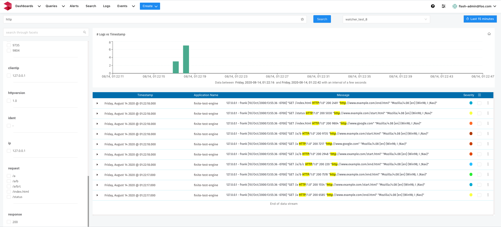

# Data extraction

## Grok basics

Grok works by combining text patterns into complex pattern expressions that can match your incoming log data stream.

The typical syntax for a grok pattern is `%{SYNTAX:SEMANTIC}`

The `SYNTAX` is the pattern identifier that will match the text. For example, `user@somedomain.com` will be matched by the `EMAILADDRESS` pattern and `10.0.1.22` will be matched by the `IPV4` pattern. The syntax can further be broken down into subpatterns composed of regular expressions.

The `SEMANTIC` is the identifier you give to the piece of text being matched. For example, `user@somedomain.com` is an e-mail address so you could call it `email`. Further, a string `10.0.1.22` might identify the `sender` making a request.

Groks patterns offer a powerful, yet simple mechanism to compose patterns for complex log matching. LOGIQ's server is written in Go and uses the popular [Grokky](https://github.com/logrusorgru/grokky) library for it Grok implementation

### Composing Grok expressions

Here is a simple example of composing grok expressions. We are going to compose a regex for hostnames and a regex for matching user names to create the Grok for email address matching

```text
"HOSTNAME" : `\b[0-9A-Za-z][0-9A-Za-z-]{0,62}(?:\.[0-9A-Za-z][0-9A-Za-z-]{0,62})*(\.?|\b)`
"EMAILLOCALPART" : `[a-zA-Z][a-zA-Z0-9_.+-=:]+`

"EMAILADDRESS": `%{EMAILLOCALPART}@%{HOSTNAME}`
```

## Grok matching rules

Grok patterns can be applied in incoming logs data via matching rules. The matching rules allow for targeting expressions to specific applications, and namespaces. Let us look at an example below.

## Example: Applying Grok matching to HTTPD logs

In the example below, the LOGIQ engine will apply the combined apache log format grok extraction rule to all application names that being with `httpd` or `Httpd` and running on namespaces that being with webservers-.

Omitting either the `applications` or the `namespaces` keyword or both, excludes matching on that criteria. For e.g. omitting `applications` means the grok pattern is applied to data from all applications from the `webservers-.*` namespaces 

```text
- name: combined_apache_log
  type: extract
  format: "%{COMMONAPACHELOG} %{QS:referrer} %{QS:agent}
  applications: [h|H]ttpd.*
  namespaces: webservers-.*
```

The above rule would result in LOGIQ parsing out data as shown below. All the extracted values from applying the above grok expression will automatically be made available as facets for filtering search data in the UI

```text
{
  "AppName": "finite-test-engine",
  "Facility": "3",
  "FacilityString": "system daemon",
  "Hostname": "watcher_test_8",
  "Message": "127.0.0.1 - frank [10/Oct/2000:13:55:36 -0700] \"GET /index.html HTTP/1.0\" 200 2481 \"http://www.example.com/end.html\" \"Mozilla/4.08 [en] (Win98; I ;Nav)\" ",
  "MsgID": "1g4Jt60f78HOYBk26BiJREdwBEG",
  "Priority": "29",
  "ProcID": "70958",
  "Sender": "::1",
  "Severity": "5",
  "SeverityString": "notice",
  "StructuredData": [
    {
      "key": "auth",
      "values": [
        "frank"
      ]
    },
    {
      "key": "bytes",
      "values": [
        "2481"
      ]
    },
    {
      "key": "clientip",
      "values": [
        "127.0.0.1"
      ]
    },
    {
      "key": "httpversion",
      "values": [
        "1.0"
      ]
    },
    {
      "key": "ip",
      "values": [
        "127.0.0.1"
      ]
    },
    {
      "key": "uri",
      "values": [
        "http://www.example.com/end.html"
      ]
    },
    {
      "key": "ident",
      "values": [
        "-"
      ]
    },
    {
      "key": "request",
      "values": [
        "/index.html"
      ]
    },
    {
      "key": "response",
      "values": [
        "200"
      ]
    },
    {
      "key": "verb",
      "values": [
        "GET"
      ]
    }
  ],
  "Timestamp": "2020-08-14T01:22:18Z",
  "Namespace": "watcher_test_8",
  "MsTimestamp": "1597368138"
}
```



## Specifying Grok matching rules

The LOGIQ ingest server can watch a rules directory for rules files as described above. The server can handle new rules being added to the system dynamically without any downtime.


In a Kubernetes environment, the rules can be added to a running server via ConfigMaps



