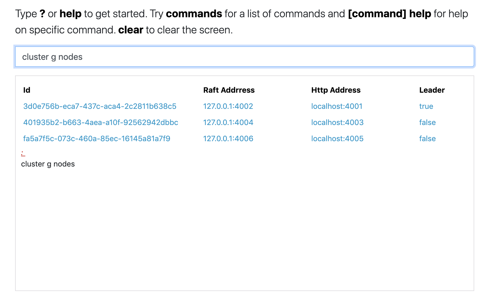

# Quickstart guide

## Using Docker compose

### Pre-requisites

#### Install Docker compose

You can spin-up LOGIQ using docker compose. Install guide for docker compose can be found here - [https://docs.docker.com/compose/install/](https://docs.docker.com/compose/install/)  
Please read and agree [EULA](https://docs.logiq.ai/eula/eula) before proceeding. 

### Running LOGIQ

First step is to get the appropriate docker compose YAML file from one of the URL's below. We provide two separate YAML files; one for the full stack with the UI, other for the ingest server.

Both of the Quickstart YAML's include a bundled S3 compatible object store from [minio](https://min.io)


_**NOTE:** the docker-compose quick-start YAML files are intended for demo and trial use only. If you want to run a production deployment, we recommend you use Kubernetes with HELM to deploy the LOGIQ stack. Please contact us at : s a l e s @ l o g i q . a i_


#### LOGIQ full-stack - Ingest server with UI

* ⬇ Download the YAML here - [https://logiqcf.s3.amazonaws.com/1.2.1/docker-compose.quickstart.yml](https://logiqcf.s3.amazonaws.com/1.2.0/docker-compose.quickstart.yml)

```bash
$ wget https://logiqcf.s3.amazonaws.com/1.2.1/docker-compose.quickstart.yml
```


NOTE: Please have 16GB of memory when running the full stack with UI


#### LOGIQ Ingest-only stack . - Ingest server only \( Does not include UI \)

* ⬇ Download the YAML here - [https://logiqcf.s3.amazonaws.com/1.2.1/docker-compose.quickstart-ingest.yml](https://logiqcf.s3.amazonaws.com/1.2.0/docker-compose.quickstart-ingest.yml)

```text
$ wget https://logiqcf.s3.amazonaws.com/1.2.1/docker-compose.quickstart-ingest.yml
```

You are now ready to bring up the LOGIQ stack. 

#### Running LOGIQ using the quick-start YAML files

Use the YAML file downloaded from the URL above to run LOGIQ. Use the UI YAML if you are interested in the full stack.

```bash
$ docker-compose -f <docker-compose.quickstart.yml | docker-compose.quickstart-ingest.yml> up -d
```

## Firewall ports and urls

### Ports

LOGIQ exposes the below ports

* **7514** - Syslog / TCP - TLS
* **514** - Syslog / TCP - Non TLS
* **2514** - RELP/Rsyslog / TCP - TLS
* **20514** - RELP/Rsyslog / TCP - Non TLS
* **9998** - Server administration web cli
* **9999** - REST API
* **8081** - GRPC \( needed for logiqctl CLI \)
* **80** - http
* **443** - https

The ports used to bind are configurable via the server configuration file. See [Server options](../logiq-log-ingest-server-configuration/server-options.md) for more details.

### Prometheus scraping

Prometheus can scrape metrics from the LOGIQ server as a scrape target.

```text
https://<logiq-server-ip>:9998/metrics
```

## Test using LOGIQ UI

Once the LOGIQ server is up and running, the LOGIQ UI can be accessed as described above on port 80 on the server docker-compose. You will be presented with a login screen as shown below. Use _flash-admin@foo.com_ / _flash-password_ to login


## Test using LOGIQ server web CLI

Once the LOGIQ server is up and running, you can connect to the Server web cli on port 9998. The default credentials are _logiq\_access_ and _logiq\_secret_



## Ingesting data

Please refer to section on [data ingestion](agentless.md) for more details.

