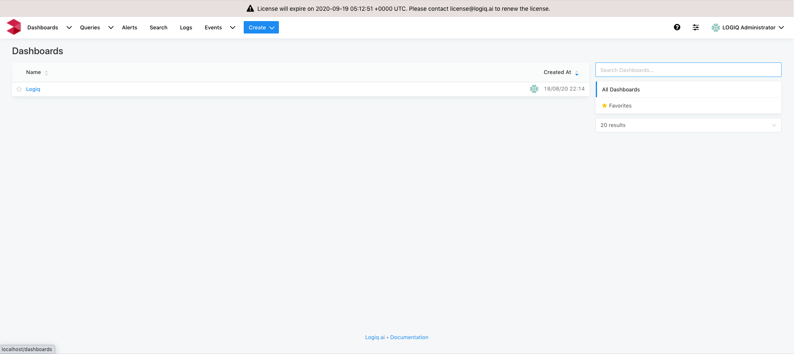

# Quickstart guide


Please read and agree with the [EULA](https://docs.logiq.ai/eula/eula) before proceeding.


## Install Docker compose

You can spin-up LOGIQ using `docker-compose`. Install guide for `docker-compose` can be found here - [https://docs.docker.com/compose/install/](https://docs.docker.com/compose/install/)


_**NOTE:** the docker-compose quick-start YAML files are intended for demo and trial use only. If you want to run a production deployment, we recommend you use Kubernetes with HELM to deploy the LOGIQ stack. Please contact us at : s a l e s @ l o g i q . a i_


## Running LOGIQ


NOTE: LOGIQ services use approximately 2GB of memory. Please have sufficient memory in your system before proceeding


The first step is to get the appropriate `docker-compose` YAML file from the URL below.

⬇ Download the YAML here - [https://logiqcf.s3.amazonaws.com/2.0.1/docker-compose.quickstart.yml](https://logiqcf.s3.amazonaws.com/2.0.1/docker-compose.quickstart.yml)

You are now ready to bring up the LOGIQ stack.

```text
$docker-compose -f docker-compose.quickstart.yml up -d
```

**NOTE:** If you have been running previous versions of LOGIQ docker-compose, you should stop and remove the existing containers by running docker-compose -f docker-compose.quickstart.yml down and remove any older docker volume via docker-compose -f docker-compose.quickstart.yml rm && docker-compose -f docker-compose.quickstart.yml rm -v


## Test using LOGIQ UI

Once the LOGIQ server is up and running, the LOGIQ UI can be accessed as described above on port 80 on the server docker-compose. You will be presented with a login screen as shown below.


Use _flash-admin@foo.com_ / _flash-password_ to login



### Prometheus monitoring and alerting

The LOGIQ quickstart file includes Prometheus and Alertmanager services and a built-in monitoring dashboard for LOGIQ.



## Ingesting data

Please refer to section on [data ingestion](agentless.md) for more details.

## Firewall ports and URLs

### Ports

LOGIQ exposes the below ports

* **7514** - Syslog / TCP - TLS
* **514** - Syslog / TCP - Non TLS
* **2514** - RELP/Rsyslog / TCP - TLS
* **20514** - RELP/Rsyslog / TCP - Non TLS
* **9998** - Server administration web cli
* **9999** - REST API
* **8081** - GRPC \( needed for logiqctl CLI \)
* **80** - http
* **443** - https
* **24224/24225** - FluentForward protocol port / TLS

The ports used to bind are configurable via the server configuration file. See [Server options](../logiq-log-ingest-server-configuration/server-options.md) for more details.

