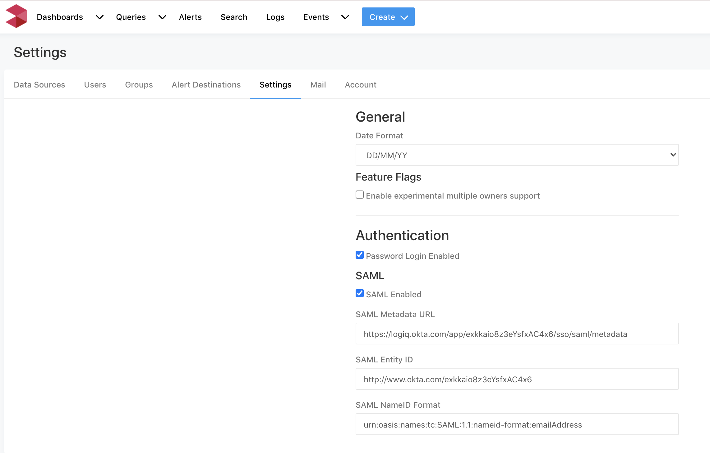
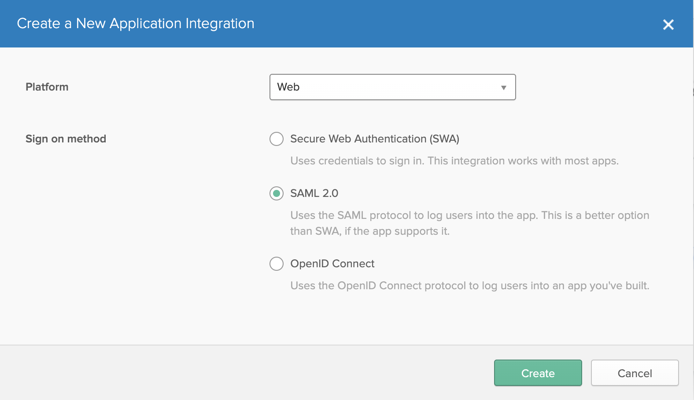
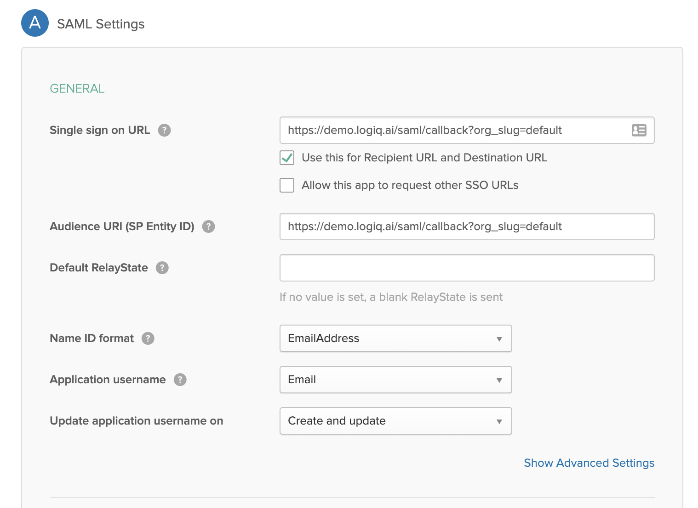
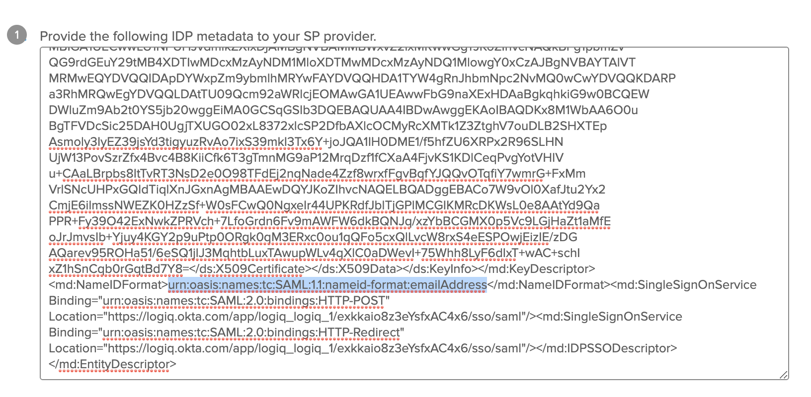
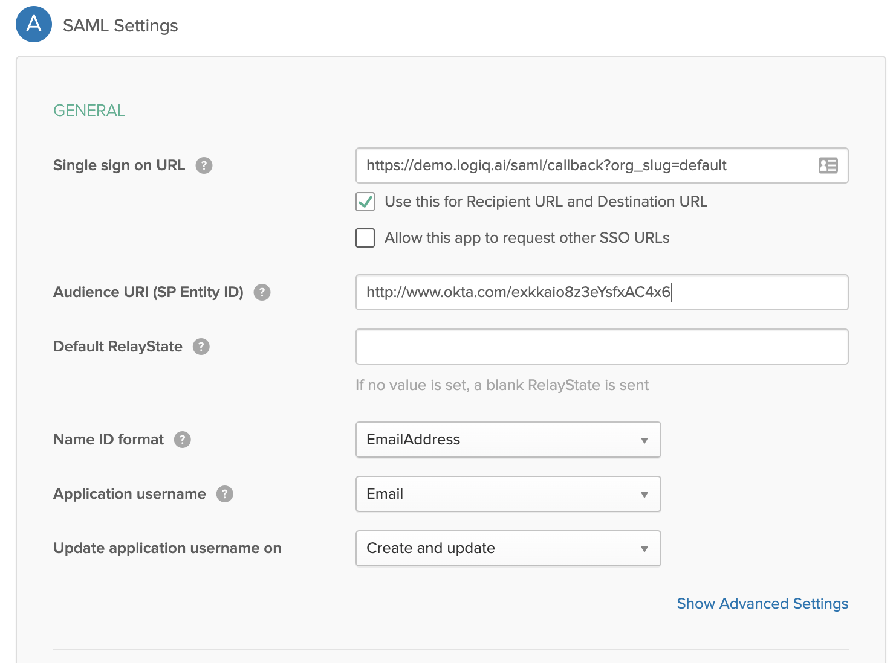

# Single Sign-On with SAML

LOGIQ can be set up for user login using Single Sign-On \(SSO\) with SAML by configuring LOGIQ as Service Provider\(SP\) and OKTA, Google, or in general any SAML2.0 compliant identity provider \(IDP\). This is a two-step process.

## Enabling SAML

Login with your admin credentials. Click on `Settings` menu. Enable _"SAML configuration"_ checkbox.   
Add SAML **Metadata URL, Entity ID, NameID Format.**

Check below on specific steps for your Identity provider

If user-groups are configured on IDP side, create the identical user groups in LOGIQ. This can be done by clicking on "_Settings"_ menu and going to Groups tab. This example shows creating "NonAdmin" user group.

  
This concludes the LOGIQ side configuration.

Logout as LOGIQ admin. In the login Screen, "SAML Login" Button should be available to login with the user's SSO credentials.  By clicking the button browser is redirected to the IDP screen where user can login using its  IDP credentials.

## IDP configuration

This document provides detailed information to configure OKTA and Google as Identity providers. For other identity providers, please refer to identity providers' documentation. In your IDP application, provide the SAML Assertion Consumer Service \(ACS\) URL for your LOGIQ environment and attribute mappings 

The following attributes are required. The LOGIQ mappings for each of the attributes are in brackets. Please use the correct attribute name otherwise LOGIQ will not be able to recognize the SAML assertion

* First name \(FirstName\) and Last name \(LastName\)
* Group name **** \(LogiqGroups\)

Use following SAML Assertion Consumer Service \(ACS\) url 


_https://**&lt;LOGIQ UI IP/Domain&gt;**/saml/callback?org\_slug=default_


With this you should be able to access a SAML metadata URL or SAML metadata file.

### Okta Configuration

This section describes Okta configuration in detail. Users should assume the Okta admin role and start in the Okta control panel by clicking the button to add a new application. Choose `Web` as the platform. The sign-on method is **SAML 2.0**.

On the next screen OKTA has fields for a few URLs:

* Single Sign-On URL
* Recipient URL
* Destination URL 
* Audience Restriction

Use your LOGIQ endpoint url in following format:  
https://&lt;LOGIQ domain name&gt;/saml/callback?org\_slug=default  
  
Set Name ID format: **EmailAddress**  
Application username: **Email**

**Configure Attribute statements:**

| **Name** | **Name Format** | **Value** |
| :--- | :--- | :--- |
| FirstName | Unspecified | user.firstName |
| LastName | Unspecified | user.lastName |

By default, any user that is created with SAML/SSO will join the default user-group in LOGIQ. It’s possible to configure OKTA to pass groups the user should join by setting the **`LogiqGroups`** parameter with the intended group name. For example, if the SAML user is a member of the NonAdmin group in Okta, at the user login, the user will be authenticated and added to "NonAdmin" group.


The `default` group in LOGIQ has access to all data sources. It is highly recommended to create a group assignment for your users and configure `LogiqGroups` as described above. This allows RBAC policies and limits access to what data a user can access


  
**Configure Attribute statements:**

| **Group Name** | **Name Format** | **Value** |
| :--- | :--- | :--- |
| **LogiqGroups** | Basic | Equals: NonAdmin |

Continue to create the application as guided by OKTA instructions. Once the application is successfully created, take note of the following information. This is **needed to configure LOGIQ.** 

1. SAML Metadata URL: "Identity Provider Metadata" URL depicted below in blue can be clicked to find out SAML metadata URL. 

2. Entity ID: By navigating to "View Setup Instruction" shown in the above snapshot, You can find Entity ID.

3. NameIDFormat: NameID can be found in the SAML metadata by searching NameIDFormat, shown as selected gray text in the picture below.

Navigate back to the app and edit "**Audience Restriction**" and set it with the IDP issuer described in \#2 above.

If already not there, create users and user groups such as`NonAdmin` in this example. Users and user groups can be also be brought in with inbound federation with ADFS or other identity providers.  
Assign the users to the Application or group such as `NonAdmin` in this example to the Application. This concludes the IDP side configuration.

### Google GSuite Configuration



