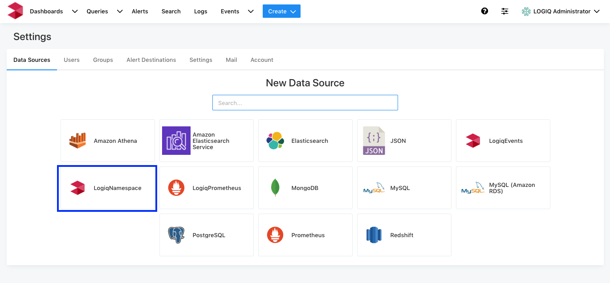
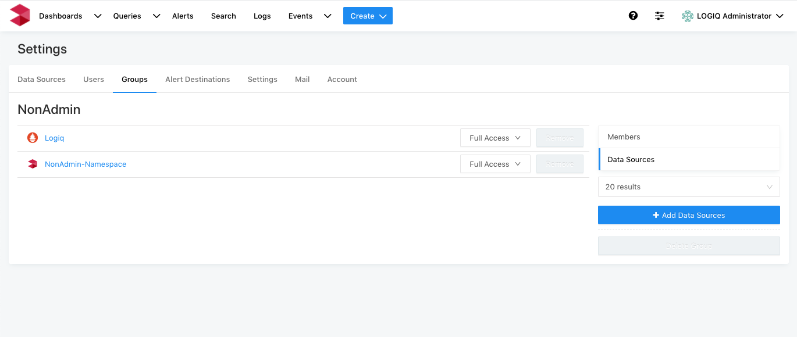

# Configuring RBAC

## Overview

LOGIQ, not only supports access to logs but also to additional data sources. LOGIQ's RBAC enforcement works by restricting access to the data source. This in-turn translates to restricting user access to queries and dashboards created on those data sources.

In addition, LOGIQ's log collection model works by mapping incoming log data into [namespaces](../logs-terminology.md#namespace). In LOGIQ, a [namespace](../logs-terminology.md#namespace) is treated as a data source, thus allowing a uniform model for applying access restrictions.

## Creating a namespace data source

Namespace restrictions are managed by the namespace data source. Only the admin users have privileges to access and modify data sources.

In the data source configuration, provide the data source settings by listing out the namespaces that are part of the data source definition. Provide a name for the data sources and then Save your configuration. In the example below, we are creating a NonAdmin-Namespace data source that has access restriction to two namespaces `customer-tooling` and `rc-logiq:rc`

## Assigning Namespace data source to users

The final step is to attach the namespace data source to a group. This restricts all users in the group to the namespaces defined in the data source.

## Managing access to namespaces from multiple clusters and hosts

Namespaces in LOGIQ map to virtual hosts or namespaces in Kubernetes clusters. Resources such as ECS clusters can also be mapped to namespaces.

Let us look at how this works in practice. In the example above, the access restrictions are applied to two namespaces `customer-tooling` and `rc-logiq:rc`

The `customer-tooling` namespace is a virtual machine with hostname `customer-tooling`. The `rc-logiq:rc` is a Kubernetes cluster with `CLUSTER_ID` set to `rc-logiq` and namespace `rc` within the cluster.

Yes it is that simple!

