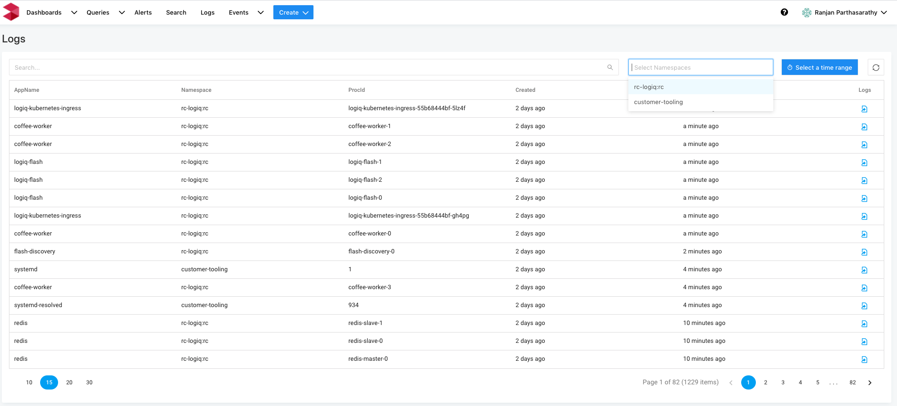

# Role-Based Access Control \(RBAC\)

## Overview

Access to log data for users is managed by namespace controls. To learn more about what namespaces are in the LOGIQ product, please refer to the section on namespaces [here](logs-terminology.md#namespace). Log data from a single namespace can contain multiple application logs. If a user has access to a namespace, the user can view logs for all applications in the namespace.

## UI Controls

When a user has restricted access to select namespaces, the UI will show only the namespaces the user can access for Logs, Search, and Events. In the example below, the user has restricted access to only 2 namespaces; `customer-tooling` and `rc-logiq:rc`

## Logiqctl Controls

LOGIQ's cli provides a similar restriction when a user tries to access resources under Role-based access controls. In the example below, the same user can be seen to only access the same namespaces;`customer-tooling` and `rc-logiq:rc`

 

